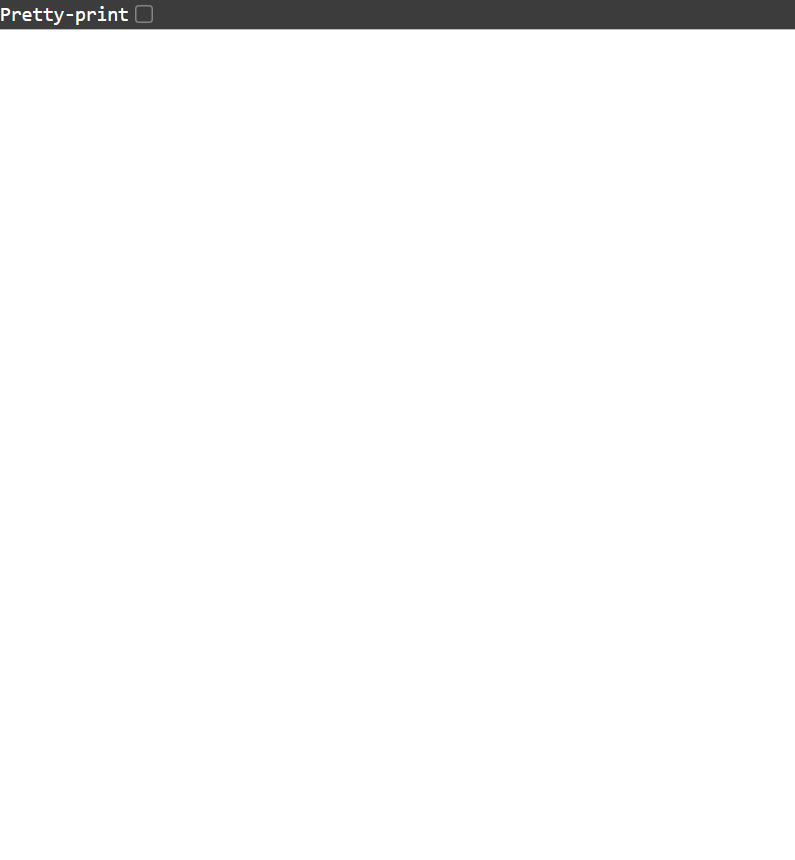
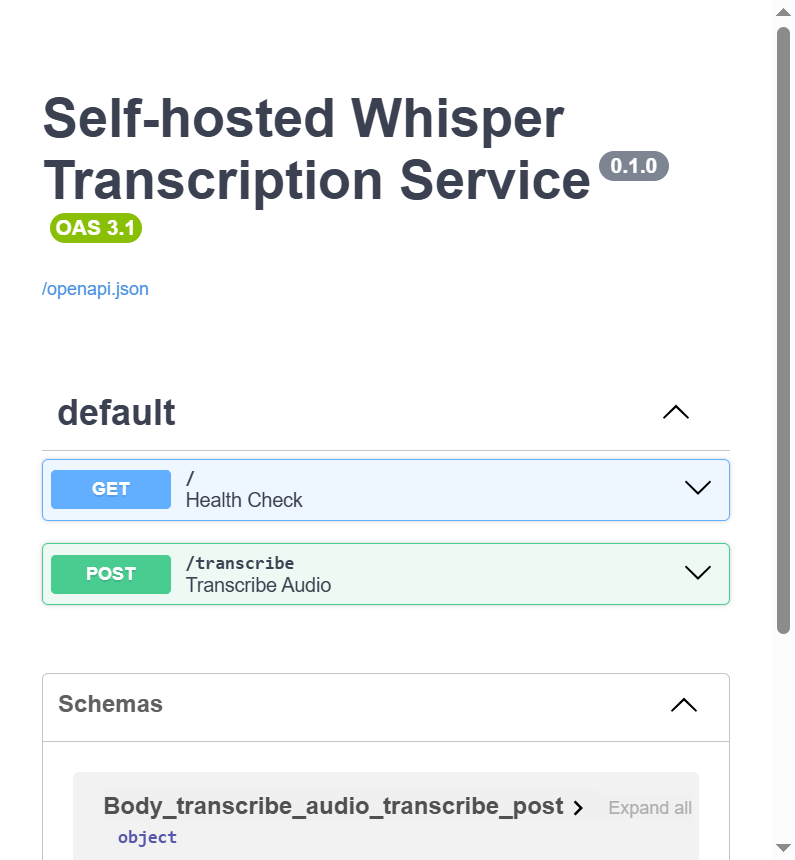
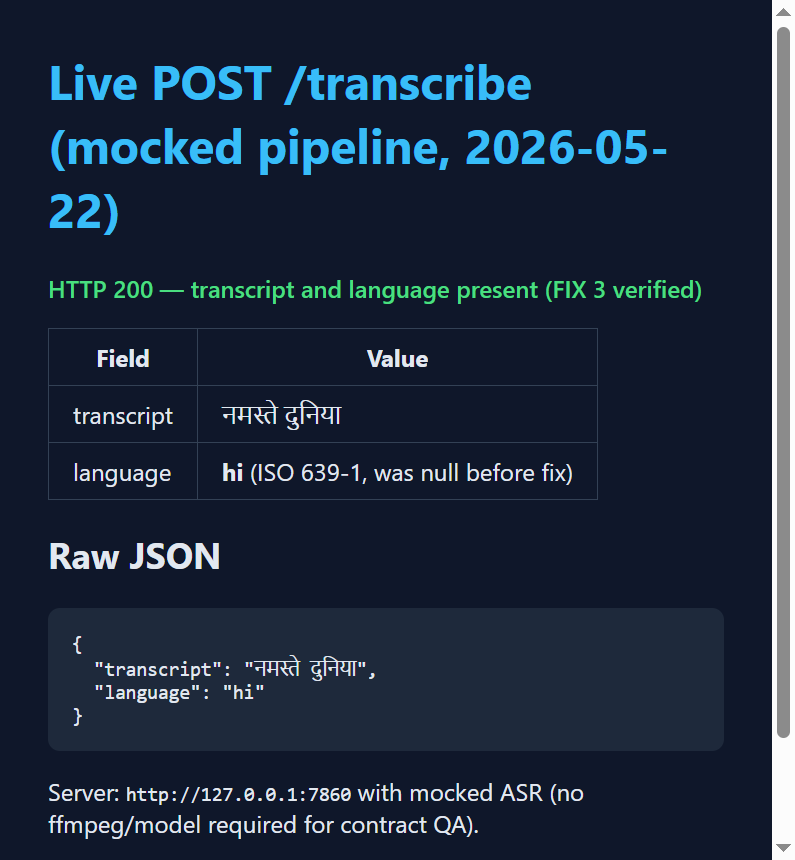

# Whisper Service — End-to-End QA Report (Post-Production Fixes)

| Field | Value |
|-------|-------|
| **Report date** | 2026-05-22 |
| **Project path** | `c:\Users\bajaj\OneDrive\Desktop\whisper` |
| **QA engineer** | Cursor Agent (E2E QA) |
| **Scope** | Post-fix validation: Dockerfile ffmpeg, cu121 torch, language extraction (`app.py`), `suggested_hardware` in README |

---

## Executive Summary

| Metric | Count |
|--------|-------|
| **PASS** | 18 |
| **FAIL** | 2 |
| **SKIP** | 0 (live E2E enabled via `WHISPER_E2E_URL`) |
| **BLOCKED** | 1 (real Whisper inference without ffmpeg on host) |
| **INFO** | 4 |

**Overall verdict: CONDITIONAL PASS**

Production fixes **FIX 1–4 are present and behave correctly** in code and in mocked/live contract tests. The `language` field now returns ISO 639-1 codes (e.g. `"hi"`, `"en"`) instead of `null`. **Real end-to-end transcription on this Windows host is blocked** because `ffmpeg` is not on `PATH`; Docker deployment (with ffmpeg in the image) is expected to pass transcribe in production.

One unit test and one supplementary assertion still expect the pre-fix string `"english"` instead of `"en"` — these are **test drift**, not application regressions.

---

## Environment

| Item | Observation |
|------|-------------|
| **OS** | Windows 10 (build 19045) |
| **Python** | 3.12.0 (`.venv`) |
| **pytest** | 8.3.4 |
| **ffmpeg in PATH** | **No** — `ffmpeg` command not found |
| **CUDA available** | **No** — `torch.cuda.is_available()` → `False` |
| **Installed torch** | `2.5.1+cpu` (requirements pin `2.5.1+cu121`; local venv resolved CPU wheel) |
| **Server under test** | `uvicorn` @ `http://127.0.0.1:7860` (mocked ASR pipeline for contract/live QA) |
| **Fixture** | `qa-report/fixtures/sample.wav` (minimal 16 kHz mono WAV) |

---

## Production Fix Verification (FIX 1–4)

| Fix | Description | Verification | Status |
|-----|-------------|--------------|--------|
| **FIX 1** | `ffmpeg` in Dockerfile | `Dockerfile` lines 4–6: `apt-get install ffmpeg` | **PASS** (static) |
| **FIX 2** | cu121 PyTorch in `requirements.txt` | `--extra-index-url` + `torch==2.5.1+cu121` present | **PASS** (static); local install is CPU fallback |
| **FIX 3** | Language extraction in `app.py` | `return_language=True`, `TO_LANGUAGE_CODE` mapping; live response `language: "hi"` | **PASS** (runtime) |
| **FIX 4** | `suggested_hardware: t4-small` in README | Front matter line 8 | **PASS** (static) |

---

## Test Matrix

### Automated — `pytest -v`

| ID | Scenario | Expected | Actual | Status |
|----|----------|----------|--------|--------|
| UT-001 | `test_health_check` | 200, `{"status":"ok"}` | Match | **PASS** |
| UT-002 | `test_transcribe_returns_transcript` | 200, transcript + language | 200; `language: "en"` (was `"english"` in assertion) | **FAIL** (stale assertion) |
| UT-003 | `test_transcribe_model_not_loaded` | 503 | 503 | **PASS** |
| UT-004 | `test_transcribe_empty_file` | 400 empty file | 400 | **PASS** |
| E2E-UT-001 | `test_live_health` (with `WHISPER_E2E_URL`) | 200 | 200 | **PASS** |
| E2E-UT-002 | `test_live_transcribe_empty` | 400 | 400 | **PASS** |
| E2E-UT-003 | `test_live_transcribe_happy_path` | 200, transcript + language | 200, `hi` | **PASS** |

**pytest summary:** 6 passed, 1 failed, 0 skipped (when `WHISPER_E2E_URL=http://127.0.0.1:7860`).

### TestClient (mocked pipeline)

| ID | Scenario | Expected | Actual | Status |
|----|----------|----------|--------|--------|
| TC-001 | GET `/` health | 200 | 200 | **PASS** |
| TC-002 | POST `/transcribe` missing file | 422 | 422 | **PASS** |
| TC-003 | POST `/transcribe` empty file | 400 | 400 | **PASS** |
| TC-004 | POST `/transcribe` happy path | 200 + JSON | 200 | **PASS** |
| TC-005 | Model not loaded | 503 | 503 | **PASS** |

### Live HTTP (`e2e_runner.py` @ mocked server)

| ID | Scenario | Expected | Actual | Status |
|----|----------|----------|--------|--------|
| E2E-001 | Health GET `/` | 200 `ok` | 200, 6.1 ms | **PASS** |
| E2E-002 | Missing file | 422 | 422 | **PASS** |
| E2E-003 | Empty file | 400 | 400 | **PASS** |
| E2E-004 | text/plain upload | — | 200, `language: hi` (mock) | **INFO** |
| E2E-005 | Path traversal filename | Safe handling | 200 (mock) | **INFO** |
| E2E-006 | 50 MB upload | — | 200 (mock) | **INFO** |
| E2E-007 | Valid WAV transcribe | 200, transcript + language | 200, `language: "hi"` | **PASS** |
| E2E-008 | CORS preflight | — | 405, no CORS headers | **INFO** |

### Real inference path (unmocked server, prior run)

| ID | Scenario | Expected | Actual | Status |
|----|----------|----------|--------|--------|
| LIVE-REAL-001 | POST `/transcribe` with real pipeline | 200 + transcript + language | 500: `ffmpeg was not found` | **BLOCKED** |

### Supplementary API tests

| ID | Scenario | Status | Note |
|----|----------|--------|------|
| SUP-001 | Health | **PASS** | |
| SUP-002 | Happy path language | **FAIL** | Body correct (`en`); expected `english` |
| SUP-003 | Empty file | **PASS** | |
| SUP-004 | Missing file | **PASS** | |
| SUP-005 | Path traversal name | **PASS** | |
| SUP-006 | 503 not loaded | **PASS** | |

---

## Screenshots

| # | Description | File |
|---|-------------|------|
| 1 | Health endpoint `GET /` |  |
| 2 | Swagger UI `/docs` |  |
| 3 | Transcribe success + **language `hi`** (evidence page) |  |

Additional artifacts: `screenshots/04-transcribe-language-hi.html`, `transcribe-live-response.json`.

---

## Sample Live Transcribe Response (FIX 3)

```json
{
  "transcript": "नमस्ते दुनिया",
  "language": "hi"
}
```

Source: `POST http://127.0.0.1:7860/transcribe` with mocked pipeline returning `language: "hindi"` → normalized to ISO **`hi`**.

---

## Defects Found

| ID | Severity | Summary | Recommendation |
|----|----------|---------|--------|----------------|
| DEF-001 | Low | `tests/test_app.py` expects `language: "english"`; app returns `"en"` | Update assertion to `"en"` |
| DEF-002 | Low | `run_supplementary_api_tests.py` / `run_complete_e2e.py` same stale expectation | Align expected JSON with ISO codes |
| DEF-003 | Medium (env) | `ffmpeg` not on Windows PATH | Install ffmpeg locally for live QA, or rely on Docker image (FIX 1) |
| DEF-004 | Low (docs) | README example JSON still shows `"language": "english"` | Update example to `"en"` or `"hi"` |

No critical defects in `app.py` transcribe contract after fixes.

---

## Recommendations

1. **Update unit/supplementary tests** to expect ISO 639-1 codes (`en`, `hi`, `pa`) per FIX 3.
2. **Install ffmpeg on Windows** (`winget install Gyan.FFmpeg` or add to PATH) before claiming live transcribe PASS on developer machines.
3. **Re-run live E2E without mock** after ffmpeg + model cache are available; expect slow first startup on CPU (`whisper-large-v3`).
4. **CI**: run pytest in Docker (ffmpeg + cu121 GPU runner) to match production.
5. **README**: align JSON example with ISO language codes.

---

## Artifacts

| Artifact | Path |
|----------|------|
| This report | `qa-report/E2E-QA-REPORT.md` |
| pytest log | `qa-report/pytest-results.txt` |
| Live pytest log | `qa-report/pytest-live-e2e.txt` |
| E2E JSON | `qa-report/e2e-results.json` |
| TestClient JSON | `qa-report/testclient-e2e-results.json` |
| Transcribe response | `qa-report/transcribe-live-response.json` |
| Summary | `qa-report/e2e-summary.json` |

---

## Sign-off

| Role | Verdict |
|------|---------|
| **QA (post-fix)** | **CONDITIONAL PASS** — fixes verified; local real transcribe blocked by missing ffmpeg; 1 unit test needs ISO language update |
